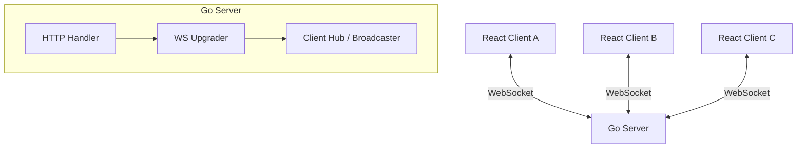

# Instant Messaging System Architecture

## Overview
This document outlines the architecture for a real-time instant messaging application. The system is designed to facilitate low-latency communication between multiple users using WebSockets.

## Technology Stack

### Backend (Server)
*   **Language:** Go (Golang)
*   **Protocol:** WebSocket (RFC 6455)
*   **Key Library:** `github.com/gorilla/websocket`
*   **Responsibility:** 
    *   Accepting and upgrading HTTP connections to WebSockets.
    *   Managing active client connections (Hub pattern).
    *   Broadcasting messages from one client to all other connected clients.
    *   Handling user join/leave events.

### Frontend (Client)
*   **Framework:** React (bootstrapped with Vite)
*   **Language:** TypeScript (or JavaScript)
*   **UI Library:** Material UI (MUI)
*   **Responsibility:**
    *   Establishing a persistent WebSocket connection to the Go server.
    *   Rendering the chat interface (Message list, Input field, Online users).
    *   Sending user messages to the server.
    *   Listening for incoming messages and state updates to update the UI in real-time.

## System Architecture



## Data Flow

1.  **Connection:** 
    *   Client initiates a handshake request to `ws://localhost:8080/ws`.
    *   Go Server upgrades the HTTP connection to a WebSocket connection.
    *   Client is registered in the server's `Hub`.

2.  **Sending a Message:**
    *   User types a message and hits send in the React app.
    *   Client sends a JSON payload (e.g., `{ "type": "message", "content": "Hello", "username": "User1" }`) over the WebSocket connection.

3.  **Broadcasting:**
    *   Go Server receives the message.
    *   The `Hub` iterates over all registered clients.
    *   The server sends the payload to each connected client.

4.  **Receiving:**
    *   React Client receives the WebSocket message.
    *   The application state is updated, and the new message is rendered in the chat window.

## Directory Structure
```
/nexus
├── backend/         # Go server code
│   ├── main.go      # Entry point
│   ├── hub.go       # Connection management
│   ├── client.go    # Per-client WebSocket logic
│   └── go.mod       # Go module definition
├── frontend/        # React application
│   ├── src/
│   ├── public/
│   ├── package.json
│   └── vite.config.ts
└── architecture.md  # This documentation
```
